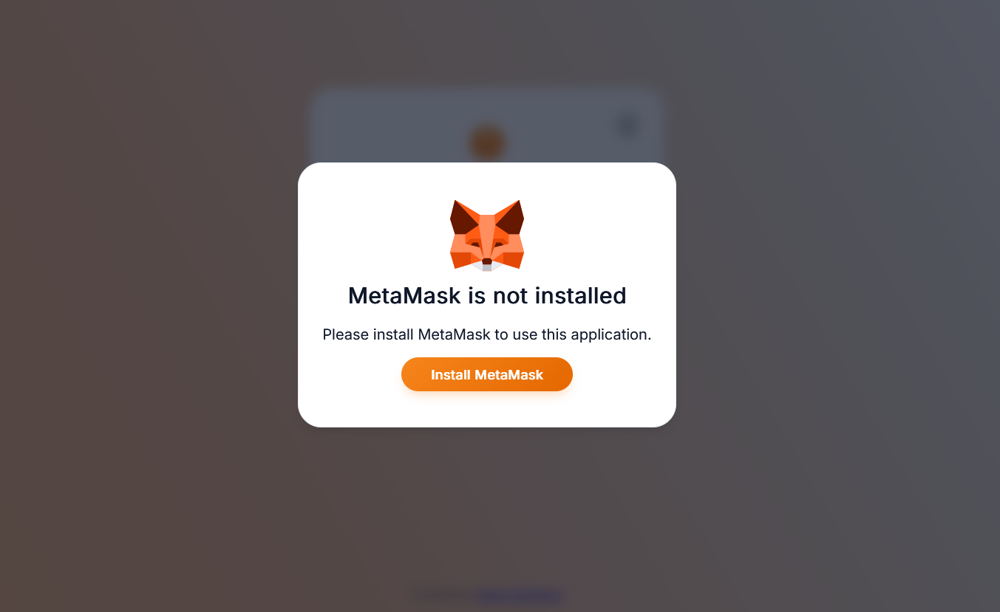
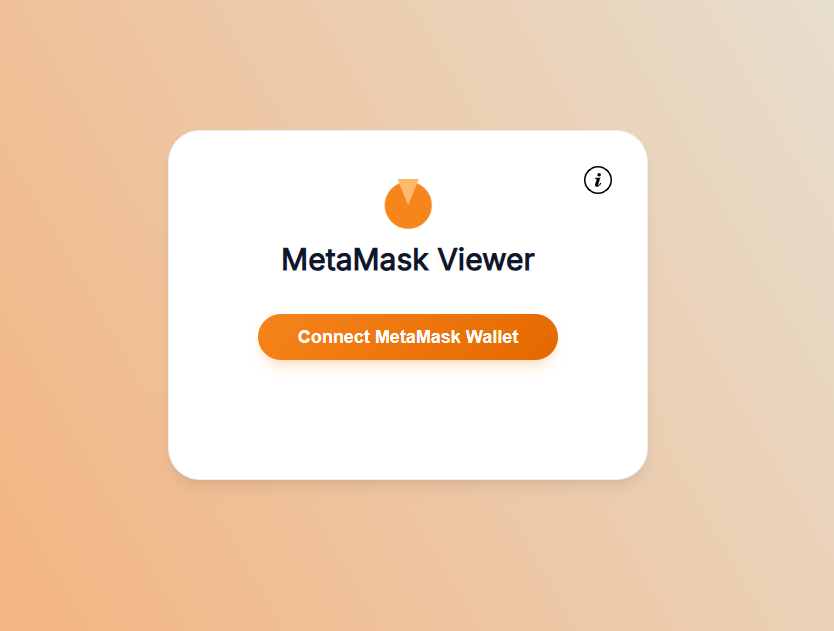
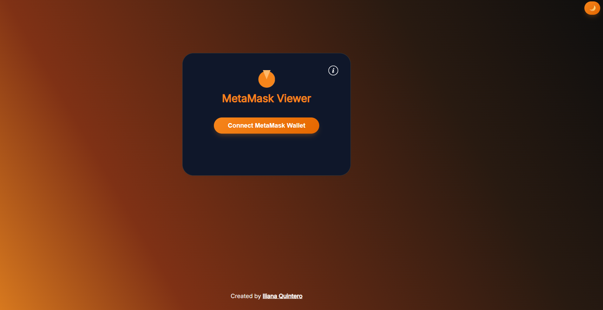
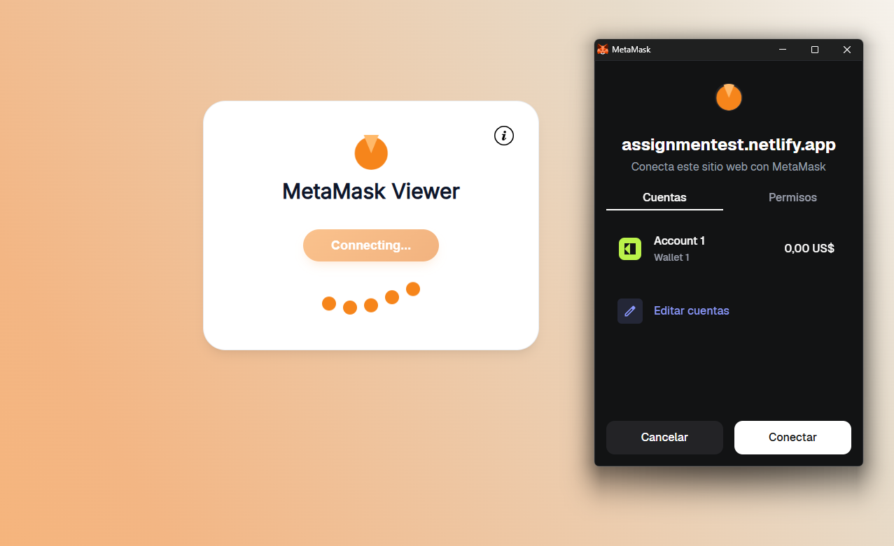
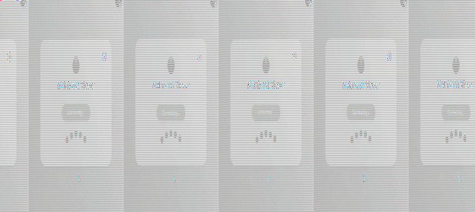
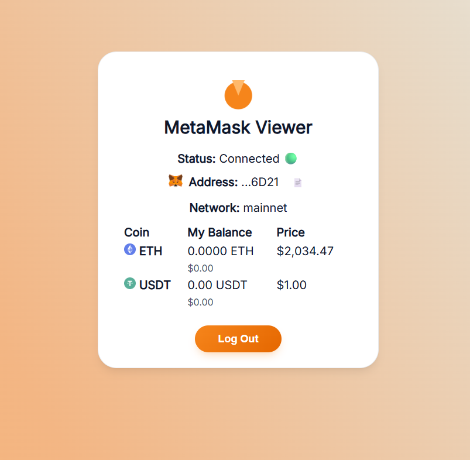
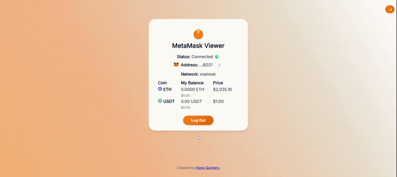

# 🦊 MetaMask Test Assignment

Create and deploy a landing page with MetaMask wallet integration.

**Live Demo**: [https://assignmentest.netlify.app/](https://assignmentest.netlify.app/)  
 **GitHub Repository**: [https://github.com/iliqb/MetaMask-test-assignment.git](https://github.com/iliqb/MetaMask-test-assignment.git)

---

## Project Overview

This project is a simple Web3 landing page that allows users to connect their MetaMask wallet and view their Ethereum (ETH) and USDT balances on the Ethereum Mainnet.

The goal of this assignment was to build and deploy a functional Web3 interface demonstrating wallet connection, blockchain interaction, and a clean user interface.

---

## Screenshot

- 
- 
- 
- 
- 
- 
- 

---

## Features

-Connect wallet using MetaMask

-Display ETH balance

-Display USDT balance

-Automatic network detection

-Copy wallet address button

-Dark / Light mode

-Responsive UI

-Loading states during wallet connection

-Modal with project information

---

## Tech Stack

-HTML

-CSS

-JavaScript

-ethers.js

-MetaMask Wallet API

---

## Technical Decisions

The application uses ethers.js to interact with the Ethereum blockchain because it provides a clean and modern API for wallet connections and contract interactions.

The USDT balance is retrieved by interacting with the ERC-20 contract using its ABI and calling the balanceOf method.

The interface was built using vanilla JavaScript to keep the project lightweight and focused on core Web3 functionality.

Dark mode and UI interactions were implemented with CSS and minimal JavaScript to maintain performance and simplicity

---

## Deployment

## The project is deployed using Netlify and can be accessed through the public URL provided above.

## Development Time

The project took approximately 30-40 hours to complete, including:

-UI design

-MetaMask integration

-Blockchain interaction

-Error handling

-Responsive layout

-Deployment

## Author

**Iliana Quintero**
